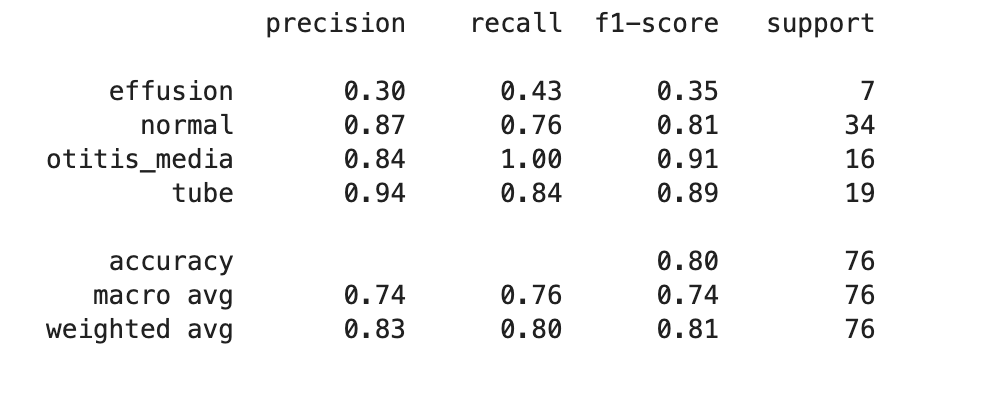

# Ear-Infection-Identifier

## Contents
 - [Problem Statement](#Problem-Statement)
 - [Executive Summary](#Executive-Summary)
 - [File Directory](#File-Directory)
 - [Data](#Data)
 - [Data Dictionary](#Data-Dictionary)
 - [Conclusions and Recommendations](#Conclusions-and-Recommendations)
 - [Areas for Further Research/Study](#Areas-for-Further-Research/Study)
 - [Sources](#Sources)
 - [Visualizations](#Visualizations)

## Problem Statement
[back to top](#Ear-Infection-Identifier)

Based on picture data from "OtoMatch: Content-based eardrum image retrieval using deep learning", can a machine learning neural networks model correctly identify if a picture of an ear drum is showing signs of an ear infection and indicate if an individual should get their ear checked by a healthcare provider. 

## Executive Summary
[back to top](#Ear-Infection-Identifier)

According to the AAP there are close to 30 million doctor's visit a year for ear infections. I saw this first hand working as a pediatric nurse practitioner and I wanted to investigate to see if a machine learning model would be able to reduce the amount of pediatric visits for this complaint and also refine the diagnoses of ear infection for providers. I think that eardrum classfication model could be used by parents at home as a tool to rule out ear infections and avoid an unnecessary visit to the doctor. A parent could take a picture of their childs ear and then see if the child’s ear is showing signs of infection. If their child's ear is showing signs of infection than the parent will need to make a doctors appointment for evaluation. Another utility of this device as referenced in the "OtoMatch: Content-based eardrum image retrieval using deep learning" article would be for providers to use eardum picutres along with their own evaluation to make sure they are accurately daignosing an ear infection in practice. This might help reduce ununnecessary antibtioic prescription by refining diagnosing.  My hope would be to make an ear infection image identifier that could successfuly indicate if:

1) Eardrum is showing signs of non infected fluid behind ear, monitor for any new/worsening symptoms and contact healthcare provider if any worsening symptoms 
2) Eardrum showing signs of infection and individual should contact healthcare provider for evaluation and management
3) Eardrum is not showing signs of infection, monitor for any new/worsening symptoms and contact healthcare provider if any worsening symptoms 
4) Eardrum is showing TM tube in eardrum, monitor for any new/worsening symptoms and contact healthcare provider if any worsening symptoms 

After using data from "OtoMatch: Content-based eardrum image retrieval using deep learning" article, I was able to create a neural networks model that could accurately classify acute otitis media, ear tube images and healthy eardrums but was unreliable at classifying non-infected fluid behind the ear. 

## File Directory
[back to top](#Ear-Infection-Identifier)

Ear-Infection-Identifier 
| 
|__ code 
|&nbsp;&nbsp;&nbsp;&nbsp;|__ 00_table_of_contents.ipynb  
|&nbsp;&nbsp;&nbsp;&nbsp;|__ 01_data_cleaning_and_eda.ipynb  
|&nbsp;&nbsp;&nbsp;&nbsp;|__ 02_preprocessing_and_modelling.ipynb  
|&nbsp;&nbsp;&nbsp;&nbsp;|__ 03_production_model.ipynb  
|&nbsp;&nbsp;&nbsp;&nbsp;|__ 04_streamlit_app.ipynb  
|&nbsp;&nbsp;&nbsp;&nbsp;|__ 05_conclusion.ipynb  
| 
|__ data  
|&nbsp;&nbsp;&nbsp;&nbsp;|__ middle_ear_images_2  
|&nbsp;&nbsp;&nbsp;&nbsp;|__ results_df2.csv  
|&nbsp;&nbsp;&nbsp;&nbsp;|__ scores_best_models.csv  
| 
|__ images  
|&nbsp;&nbsp;&nbsp;&nbsp;|__ confusion_matrix_12.png  
|&nbsp;&nbsp;&nbsp;&nbsp;|__ f1_score_and_recall_mdoels.png  
|&nbsp;&nbsp;&nbsp;&nbsp;|__ test_data_result_model_12.png  
| 
|__ presentation  
|&nbsp;&nbsp;&nbsp;&nbsp;|__ Ear_Infection_Identifier.pdf  
| 
|__ streamlit_and_models  

| 
|__ README.md  
|__ LICENSE  

## Data
[back to top](#Ear-Infection-Identifier)

Data downloaded from "OtoMatch: Content-based eardrum image retrieval using deep learning" at https://journals.plos.org/plosone/article?id=10.1371/journal.pone.0232776.

The picture data was placed into three categories already from the download. The three categories are pictures of ears with tympanostomy tubes(TM tubes) with 96 images, healthy(normal) eardrums with 179 images and eardrums with fluid(infected and noninfected fluid)behind the eardrum with 179 images.

The previous authors of the research study had already performed data augmentation by rotating and scaling images. The previous authors had also preprocessed the images to isolate the region of interest.

I resorted the images into 5 different categories:

1) Effusion (38 images): Showing signs of not infected fluid (clear or serous fluid) behind the eardrum
2) Otitis Media (80 images): Showing signs of infected eardum (purulent fluid) behind the eardrum
3) TM Tube (96 images): Eardrum images with TM tube through eardrum
4) Healthy Eardrum(173 images): No signs of fluid behind eardrum or TM tube
5) Unclear (67 images): Images that has been augmented that I could not identifiy

Images categories divided into each category with .2 of each category going to test images. 

I decided to not use unclear images in training and testing of this model. When using all five categories, I got unreliable results. Better results were obtained with using just the effusion, normal, tube and otitis media categories. 

## Data Dictionary
[back to top](#Ear-Infection-Identifier)

| Feature            | Python Type | Data Type  | Descritpion   |
| ---                | ---         | ---        | ---           |
| 01_effusion            | image    | image | pictures of otitis media with effusion(non-infected fluid behind eardrum)  |
| 02_normal            |   image     | image | pictures of healthy eardrums |
| 03_otitis_media            | image     | image | pictures of otitis media (infected eardrums)|
| 04_tube            | image     | image | pictures of eardrum with tympanostomy tubes (TM tubes) |

## Conclusions and Recommendations
[back to top](#Ear-Infection-Identifier)

I performed 17 neural network models on the images. The metrics of most relevance are weighted accuracy, precision, and recall. These are appropriate since the dataset is imbalanced. I also want to look at test data f1 scores and recall scores for otitis media to reduce the amount of type II error or false negatives. Therefore, we would want a high recall and f1 score for otitis media. These are appropiate since we want to reduce the number false negatives in the model. Overall, the pretrained models MobileNetV2, VGG16, Xception, InceptionV3 underperformed in comparison to the other models. The most successful model was a neural network model 12 with convolutional layer, augmented data, max pooling, two dense layers and a dropout layer of 0.1. This model had the highest test recall and f1 score for otitis media:  

test otitis media recall score: 1

test otitis media f1 score: 0.91

The model had a weighted accuracy score of 0.8 with test data and weighted average f1 score of 0.81.

Overall, this model performed the best at reducing type II error or false negative for otitis media. This an important metric for this model since we want to make sure that a child with an ear infection would be advised to get evaluated. This model also did very well at classifying normal and tube correctly. However, this model struggles with identifying effusion correctly with test effusion precision score of 0.3, test f1 score of 0.35, and test recall score of 0.43. 

Therefore, I think this model could be helpful in reducing the number of visits to healthcare prividers offices by ruling out otitis media at home but I think the model needs improvement if it was to be used to distiguish otitis media from otitis media with effusion. 

## Areas for Further Research/Study
[back to top](#Ear-Infection-Identifier)

For future studies, a larger training dataset would help the overall performance of the model. 

Another aspect that should be noted is the quality of the ear drum images. Many images online are very clear. If this application was to be used in real life there may be images that have cerumen obstructing part of the image. Future studies should implement images with slight obstructions and TM ear tubes in training data as well. Images should not be completely obstructed since this could impact proper evaluation of ear drum. 

This model will only be trained to evaluate middle ear infection and will not be trained on otitis externa or outer ear infections. To expand the utility of this model. Images of otitis externa could be trained into the model as another category.

## Sources
[back to top](#Ear-Infection-Identifier)

https://www.cdc.gov/drugresistance/about/how-resistance-happens.html
https://journals.plos.org/plosone/article?id=10.1371/journal.pone.0232776
https://www.healthychildren.org/English/health-issues/conditions/ear-nose-throat/Pages/Middle-Ear-Infections.aspx

## Visualizations
[back to top](#Ear-Infection-Identifier)

